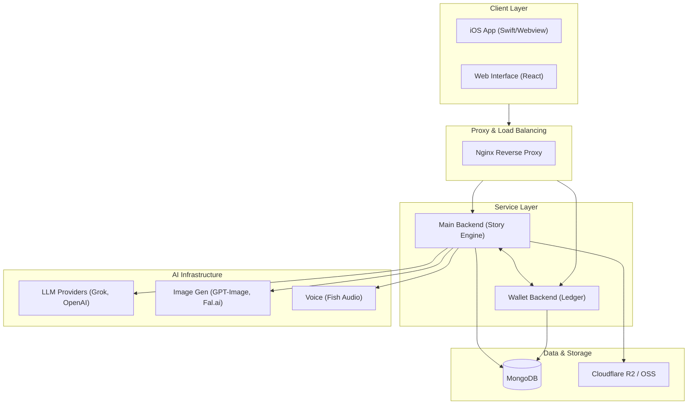
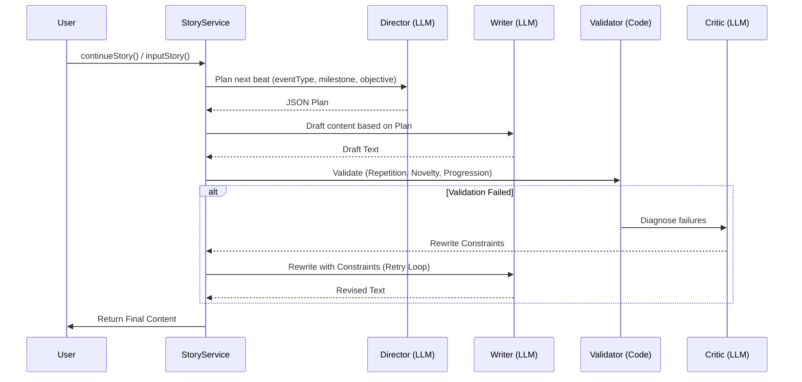

# AI Host Project: Architecture Deep Dive

## 1. Executive Summary
AI Host is a multi-modal AI platform designed for immersive storytelling and social interaction. It goes beyond simple LLM chat by integrating **Spatial Avatars** (2.5D visual rendering), **Story Skeleton** (structured narrative progression), and **Closed-Loop Context Engineering** (automated quality control).

## 2. Technology Stack

| Layer | Technology | Purpose |
| :--- | :--- | :--- |
| **Frontend** | React 18, Vite, TailwindCSS | Web UI & State management |
| **Visual Engine** | custom WebGL / GLSL Shaders | 2.5D Parallax & Lighting for Avatars |
| **Main Backend** | Node.js (Express) | Story orchestration & Agent management |
| **Wallet Backend** | Node.js (Express) | Decoupled ledger & Transaction management |
| **Storage** | MongoDB (Mongoose) | Primary metadata & persistent states |
| **OSS** | Cloudflare R2 / Alibaba OSS | Media assets (images, videos, spatial maps) |
| **AI (Text)** | xAI Grok-2, DeepSeek V3 | Narrative generation & planning |
| **AI (Image)** | GPT-Image-1.5, Fal.ai (Flux) | Context-consistent visual generation |
| **AI (Voice)** | Fish Audio | Text-to-Speech (TTS) |

## 3. System Architecture

---

## 4. Core Engineering Flows

### 4.1 Closed-Loop Story Generation (v2 Workflow)
The narrative engine follows a multi-agent "Director-Writer-Critic" pattern to ensure plot progression and prevent repetitive loops.

- **Director**: Plans the macro "what" (events, locations, stakes).
- **Writer**: Executes the micro "how" (sensory descriptions, psychological monologues).
- **Validator**: Checks for n-gram overlap, event trigger words, and director-contract realization.
- **Critic**: Diagnoses why a generation failed and provides explicit "Must include/Avoid" rules for the retry.

### 4.2 Spatial Visuals (2.5D Parallax)
Avatars are rendered using a custom WebGL shader that maps 2D images to 3D-like visuals using generated metadata:
- **Base Color**: The standard character image.
- **Depth Map**: Controls pixel displacement for 景深 (Depth of Field) and视差 (Parallax).
- **Normal Map**: Allows real-time lighting calculation (rim light, highlights).
- **Cutout**: Separates the character from the background for layering.

---

## 5. Data Schema & Lifecycle

### 5.1 Agent System (`Agent.js`)
- **Visuals**: `avatarSpatialMetaUrl` links to the Fal-generated 3D-metadata package.
- **Narrative**: `storyConfig.skeleton` defines the "Story Arcs", "Beats", and "Milestones".
- **Monetization**: `skeleton.milestones` triggers `milestone_unlock` paywalls.

### 5.2 Story Session (`StorySession.js`)
- **State**: Tracks `arcId`, `beatIndex`, and `milestonesHit`.
- **History**: Stores `paragraphs` (content + image metadata).
- **Context**: Maintains `objective` (current goal) and `locationHistory`.

### 5.3 Attribution & Tuning (`StoryAttribution.js`)
Records metadata for every paragraph generated:
- **Process**: Workflow version, prompt hashes, validation results, retry counts.
- **Signals**: Likes/Dislikes, Dwell time, Continue rates, Pay events.
- **Loop**: Used for **Online Tuning** of prompt variants via `PromptExperiment`.

---

## 6. Infrastructure & Deployment

- **Containerization**: Full Docker Compose environment.
- **Persistence**: MongoDB volume for local data; R2 for global media assets.
- **Deployment Script**: `ai-host-deploy.sh` handles automated git syncing, container rebuilding, and health checks.
- **Security**: Nginx handles SSL termination; backend services use `env_file` for secret management.
